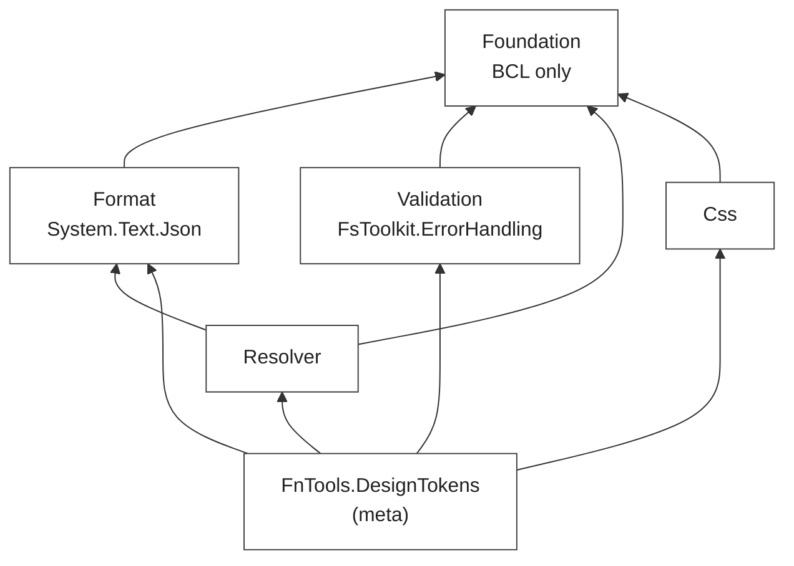

## Context

The original implementation was a single assembly (~3200 LOC, 7 files). All concerns lived together: domain types, JSON parsing, validation, alias resolution. A consumer who only needed parsing pulled in validation and resolver code. Dependencies could not be controlled per layer.

## Decision

Split into five focused projects plus a meta-package:

| Project | Responsibility | Key dependency |
|---|---|---|
| `Foundation` | Domain types, smart constructors | BCL only |
| `Format` | JSON parse/serialize (DTCG ↔ domain) | `System.Text.Json` |
| `Validation` | Invariant checks (ranges, cycles, consistency) | `FsToolkit.ErrorHandling` |
| `Resolver` | Multi-set merge, modifier contexts | Foundation + Format |
| `Css` | CSS custom-property emitter | Foundation only |
| `FnTools.DesignTokens` | Meta-package — re-exports all five | All above |

*Note (post-v0.12.0): the layout has since grown to 8 packages — `FSharp` (renamed from `Bindings`, ADR-039) and `TokensStudio` follow the same Foundation-only translator pattern as `Css`.*

## Consequences

- A CLI tool that only parses and emits CSS takes `Foundation` + `Format` + `Css` — no validation or resolver overhead.
- `Foundation` has zero non-BCL dependencies, making it suitable as a shared type surface across the FnHCI family.
- Each layer is a separately publishable NuGet package.
- Adding new output targets (TOML emitter, typed bindings emitter) means new projects, not changes to existing ones.
- The meta-package `FnTools.DesignTokens` exists for consumers who want everything in one reference.
