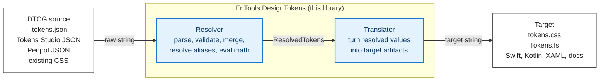

# Concept — Where this library sits

If you have a `.tokens.json` file and need it to become CSS, F# code, Swift constants, or anything else: this library is the middle. It is not the design tool, it is not the platform. It is the codec and the resolver between them.

This page is the mental model — read it once, then the ADRs make sense.

---

## The pipeline

The DTCG Community Group describes the design-token toolchain as four stages:

```
┌──────────────┐    ┌───────────┐    ┌────────────┐    ┌────────────┐
│ DTCG source  │ →  │  Resolver │ →  │ Translator │ →  │   Target   │
└──────────────┘    └───────────┘    └────────────┘    └────────────┘
   .tokens.json     choose values    turn resolved      CSS, F# code,
   .resolver.json   for a context    values into        Swift, Kotlin,
   Tokens Studio    (theme, brand,   target-native      XAML, docs,
   JSON, Penpot     mode, density,   artifacts          design tools …
   JSON, ad-hoc     accessibility)
   CSS …
```

The same pipeline as a Mermaid diagram, with the library's slice highlighted and the wire-level contracts labelled (renders inline in Forgejo and most Markdown viewers):



**This library fills the Resolver and Translator stages.** It does not author tokens (the design tool does that) and it does not run a UI (your application does that). It accepts strings as input and returns strings as output — see [ADR-003: I/O belongs to the caller](../LOGOS/decisions/003-io-belongs-to-caller.md).

The boundary is sharp on purpose: see [ADR-013: Library scope ends at the DTCG interchange boundary](../LOGOS/decisions/013-library-scope-dtcg-interchange-boundary.md).

---

## What "Resolver" means here

A token file is rarely a flat list of concrete values. Real-world inputs look like:

- A primitive layer (`color.green.500 = oklch(...)`) plus a semantic layer (`color.action.default = {color.green.500}`)
- Multiple sets that compose by inheritance (Cheddar → CheddarBooks → LaundryLog)
- A `.resolver.json` that picks which sets apply for `theme=dark, density=compact`
- Tokens Studio scale tokens authored as math expressions (`round({base} * pow({multiplier}, 2))`)
- HSL expressions (`hsla({hue.blue}, {saturation}, {lightness.600}, 1)`)

The Resolver stage takes all of that and produces a flat sequence of `(path, resolved-value)` pairs. The math is evaluated, the aliases are followed, the right set wins per the resolver document, and the typography composites are normalised.

See [ADR-015: DTCG resolver for design system inheritance](../LOGOS/decisions/015-dtcg-resolver-for-design-system-inheritance.md) and [ADR-034: `tsMathExpression` post-resolve evaluation](../LOGOS/decisions/034-evaluate-math-extensions-post-resolve.md).

---

## What "Translator" means here

The Translator turns the resolved sequence into a target artifact. CSS custom properties, F# constants, Swift extensions, Kotlin theme data, XAML resource dictionaries — every target is a different translator.

Each translator is its own package. A consumer that only needs CSS does not pull in the F# code emitter. A consumer that only emits Swift never references the CSS layer. Adding a new target is adding a new package, not modifying the core.

See [ADR-039: Emitter contract and naming convention](../LOGOS/decisions/039-emitter-contract-and-naming.md).

---

## The universal handoff

Every Translator receives the same type, exposed under a named alias since v0.13.0:

```fsharp
type ResolvedTokens = (string list * ResolvedToken) seq
```

The `string list` is the token's dotted path as segments (`["color"; "accent"; "default"]`). The `ResolvedToken` is the post-resolution value — concrete, typed, alias-free, type-non-optional. This is the boundary between the Resolver stage and any Translator.

Two consequences:

- **One resolve, many translations.** The same `ResolvedTokens` feeds CSS, F# bindings, Swift, Kotlin, and docs simultaneously.
- **Adding a new Translator is decoupled.** A `FnTools.DesignTokens.Swift` package consumes the same `ResolvedTokens` that `Css` and `FSharp` consume. The Foundation, Format, Validation, and Resolver layers do not change.

See [ADR-012: Structural enforcement over documentation](../LOGOS/decisions/012-structural-enforcement-over-documentation.md) for why `ResolvedToken` has no `Alias` case and `Type` is non-optional.

---

## Package layout reflects the pipeline

```
┌── Translator stage ─────────────────────────────┐
│                                                  │
│  Css ──────────► tokens.css                      │
│  FSharp ───────► Tokens.fs                       │
│  TokensStudio ─► penpot.json (round-trip)        │
│  (future: Swift, Kotlin, Xaml … same pattern)    │
│                                                  │
└──────────────────▲───────────────────────────────┘
                   │
                   │ consumes: ResolvedTokens
                   │
┌── Resolver stage ─────────────────────────────┐
│                                                │
│  Resolver ────► multi-set merge, alias graph, │
│                 axis/modifier contexts,        │
│                 math expression evaluation     │
│                                                │
│  Validation ──► strict / permissive checks,   │
│                 error accumulation             │
│                                                │
│  Format ──────► JSON parse / serialize         │
│                                                │
│  Foundation ──► domain types (zero non-BCL    │
│                 dependencies)                  │
│                                                │
└────────────────────────────────────────────────┘
```

The eight packages exist for two reasons:

- **Minimum dependency footprint per consumer.** A Swift project never references `FSharp`. A CSS-only project never references `TokensStudio`.
- **A clean place for each concern.** Identifier-safety rules for F# (ADR-038) live in `FSharp`, not in `Validation`. Calc-preserving emission (ADR-027) lives in `Css`, not in `Resolver`.

See [ADR-001: Layer split](../LOGOS/decisions/001-layer-split-architecture.md).

---

## What is and is not a "design token"

This library handles the 13 DTCG token types: `color`, `dimension`, `number`, `fontFamily`, `fontWeight`, `fontStyle`, `fontSize`, `duration`, `cubicBezier`, `boolean`, `string`, `transition`, `shadow`, `gradient`, `typography`, `strokeStyle`, `border`.

It does **not** handle:

- Layout rules (flex direction, grid templates, alignment)
- Component structure (which elements compose a button)
- Slot composition (icon-left vs icon-right)
- Responsive behaviour rules (breakpoint *values* are dimensions; the rules that apply them are not)
- Animation choreography (durations and easings are tokens; *what* animates *when* is not)

These belong to the consumer of the library — your component system, your design tool, your Storybook equivalent. The library stops at "here are the resolved token values for the requested context." See [ADR-013](../LOGOS/decisions/013-library-scope-dtcg-interchange-boundary.md) for the full scope statement.

---

## Two-tier file model

Most design systems describe three token tiers: primitive, semantic, component. This library expects only the first two in token files. Component-tier tokens — "what colour is the button background in the primary variant?" — live in your component code, where the F# type system can check the references at build time.

See [ADR-017: Component token tier lives in code, not in `.tokens.json` files](../LOGOS/decisions/017-component-token-tier-lives-in-code.md).

---

## Strict by default; opt-in to laxness

The library validates strictly against DTCG by default. Vendor extensions and known-safe authoring patterns (Tokens Studio's `dimension`-aliases-`number` scale pattern, for example) require explicit opt-in via `ValidateOptions` and named functions like `importWithResolverEvaluatingExtensionsWith`.

This is deliberate: a caller who does not opt in receives DTCG-conformant behaviour with no surprises. A caller who needs Tokens Studio semantics writes the opt-in at the call site, and the choice is visible in code review.

See [ADR-035: `ValidateOptions` for opt-in laxness](../LOGOS/decisions/035-validate-options-opt-in-laxness.md) and [ADR-034](../LOGOS/decisions/034-evaluate-math-extensions-post-resolve.md).

---

## Where to go next

- **First-time user**: [`docs/getting-started.md`](./getting-started.md) — five-minute walkthrough from `.tokens.json` to CSS + F# bindings.
- **Specific function or type**: [`docs/api-reference.md`](./api-reference.md).
- **Why-was-it-decided-that-way**: [`LOGOS/decisions/`](../LOGOS/decisions/) — 39 ADRs, indexed by topic in [`LOGOS/decisions/README.md`](../LOGOS/decisions/README.md).
- **Adding a new target language**: [`ADR-039`](../LOGOS/decisions/039-emitter-contract-and-naming.md).
